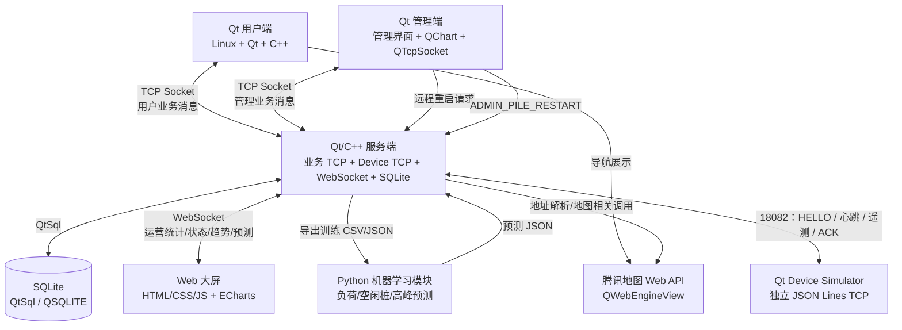

# 东软电动汽车充电桩应用管理平台

本项目是计科小学期一周开发项目。当前 `develop` 已具备可运行的集成 Demo：
Qt 用户端和管理端通过同一个 Qt/C++ Socket Server 访问 SQLite；服务端同时
提供独立的 Device Simulator TCP 网关和 Dashboard WebSocket 端点。用户头像、
地图导航、用户/管理端核心流程、设备心跳/遥测/故障恢复和基础自动化回归均已接入。
ML 自动训练与生产级设备接入仍按各模块文档持续迭代。

根据当前评审结论，项目主技术路线调整为：

- 用户端：Linux + Qt + C++；
- 服务端：Linux + Qt + C++；
- 管理端：Linux + Qt + C++；
- 数据库：QtSql + SQLite，Qt 驱动名为 `QSQLITE`；
- 通信：Socket；
- Web 大屏通信：WebSocket；
- 主程序：Qt 事件循环、信号槽与异步地图回调；
- 管理端图表：QChart；
- 导航：腾讯地图 Web API + QWebEngineView；
- 大屏：Web + ECharts；
- 机器学习：负荷、空闲桩和高峰时段预测。

Spring Boot、MySQL 和 REST 不再作为项目主架构组成部分。

## 1. 项目目标

系统最终应形成真实业务数据闭环：

```text
Qt 用户端产生充电行为
        ↓
Socket 消息进入 Qt/C++ 服务端
        ↓
Qt 服务端执行业务规则并写入 SQLite
        ↓
Qt 管理端通过 Socket 读取运营变化并展示 QChart
        ↓
Web 大屏通过 WebSocket 接收运营与预测数据
        ↓
Python ML 使用历史数据预测
        ↓
预测 JSON 交由 Qt 服务端校验并写入 SQLite
```

## 2. 系统模块

### 2.1 Qt 用户端

面向新能源汽车车主，覆盖手机号登录与自动注册、用户资料维护、头像选择、钱包充值、地址定位、附近充电站查询、腾讯地图导航、充电桩选择、订单创建、充电模拟、停止充电、计费结算、未完成订单检查和预测推荐展示。

用户端使用 `QTcpSocket` 与 Qt/C++ 服务端通信，不直接访问 SQLite。

### 2.2 Qt/C++ 服务端

服务端独立承担业务服务职责，不包含管理界面：

- 使用一个 `QTcpServer` 同时接收 Qt 用户端和 Qt 管理端连接；
- 处理登录、站点、电桩、订单、充值、结算等核心业务；
- 通过 QtSql 的 `QSQLITE` 驱动读写 SQLite；
- 使用 Qt 事件循环处理连接、充电计时、数据库写入和 WebSocket 推送；
- 向 Web 大屏提供 WebSocket 数据服务；
- 支持管理员登录、站点/电桩/用户/订单管理、冻结/解冻、远程重启，以及
  Device Simulator 的连接、心跳、遥测、故障与 ACK 处理。

### 2.3 Qt 管理端

管理端是独立 Qt 客户端，不直接访问 SQLite，也不承担服务端监听职责：

- 通过 `QTcpSocket` 与 Qt/C++ 服务端通信；
- 使用 QChart 展示营收趋势和电桩状态统计；
- 提供管理员登录、站点管理、电桩管理、用户管理、冻结/解冻、手机号模糊查询和远程重启操作界面；
- 所有管理操作必须通过服务端业务消息完成。

### 2.4 SQLite 数据库

SQLite 是主业务数据库。当前 `database/schema.sql` 定义 13 张表和 22 个索引：
业务用户/管理员/站点/电桩/订单/充值/预测/操作日志，以及 ML/CARY 历史导入、
充电会话和站点小时指标。运行时数据库为 `database/evcharge.db`，通过
`database/schema.sql` 和 `database/init_data.sql` 初始化。

### 2.5 Web 数据可视化大屏

Web 大屏使用 HTML、CSS、JavaScript 和 ECharts 展示统计与预测数据。V1 采用 WebSocket 连接 Qt/C++ 服务端，由服务端推送或按请求返回运营统计、状态分布、趋势和预测结果。

### 2.6 Python 机器学习模块

ML 模块保留为基本功能，负责基于固定演示数据和服务端导出的运行时训练数据完成负荷预测、空闲桩预测和高峰时段预测。ML 不直接访问 SQLite；Qt/C++ 服务端校验其预测 JSON 后写入数据库并推送展示结果。

### 2.7 远程重启模拟

设备侧以独立的 JSON Lines Simulator 协议接入服务端，不替代用户端和管理端的
TCP 业务协议。服务端维护受管电桩在线状态、最近心跳与遥测；`OFFLINE` 电桩在
合法 `DEVICE_HELLO` 且无活动订单时恢复为 `AVAILABLE`，`FAULT` 不会因重连自动清除，
仍须由管理员远程重启等正式流程恢复。数据库状态始终是业务状态权威。

## 3. 总体架构



## 4. 仓库结构

```text
evcharge-platform/

├── qt-user/
├── qt-admin/
├── qt-server/
├── database/
│   ├── schema.sql          # 13 表、22 索引的正式契约
│   ├── init_data.sql       # 演示种子数据
│   ├── simulation/         # CARY 数据导入与 ML-history 工具
│   └── evcharge_cary_simulation.db
├── qt-device-simulator/    # 独立设备协议模拟器
├── web-dashboard/
├── ml/
├── docs/
│   ├── 00-SRS-V1.0.md
│   ├── 01-ARCHITECTURE.md
│   ├── 02-DEVELOPMENT-GUIDE.md
│   ├── 03-API.md
│   ├── 04-DATABASE.md
│   ├── 05-GIT-WORKFLOW.md
│   ├── 06-AGENT-GUIDE.md
│   └── 07-DEVICE-PROTOCOL.md
├── README.md
└── .gitignore
```

## 5. 文档

| 文档 | 作用 |
| --- | --- |
| `docs/00-SRS-V1.0.md` | 需求基线候选版 |
| `docs/01-ARCHITECTURE.md` | Qt/C++ 服务端、Qt 管理端、Socket、SQLite 架构 |
| `docs/02-DEVELOPMENT-GUIDE.md` | Qt/C++ 开发、线程、错误处理和模块规范 |
| `docs/03-API.md` | Socket/WebSocket 应用层消息协议与 ML 数据交换 |
| `docs/04-DATABASE.md` | SQLite 与 QtSql 数据库规范 |
| `docs/05-GIT-WORKFLOW.md` | Git、Review、集成规范 |
| `docs/06-AGENT-GUIDE.md` | Agent 协作约束 |
| `docs/07-DEVICE-PROTOCOL.md` | 远程重启模拟与扩展设备协议 |
| `docs/09-USER-BACKEND-DESIGN.md` | 用户、头像、钱包、地图、订单与推荐实现设计 |
| `docs/10-SERVER-BACKEND-V1-DEMO.md` | 当前统一服务端的组成、运行和验证说明 |

## 6. 当前待确认事项

- 后续是否需要为耗时 ML 或批量任务引入独立 `QThread`。
- ML 是否有老师提供的统一数据集或最低精度要求。
- 团队成员角色 PM / TL / PRL / SCML / PE 的最终负责人。

## 7. 本机/虚拟机快速启动

首次运行先用 `database/schema.sql` 与 `database/init_data.sql` 初始化
`database/evcharge.db`。Linux Qt 6 环境可分别构建或使用顶层工程构建。服务端必须最先启动：

```bash
qmake6 evcharge-platform.pro
make -j2

./qt-server/evcharge-qt-server --database "$PWD/database/evcharge.db"
```

默认端口为：业务 TCP `18080`（User/Admin）、Dashboard WebSocket
`ws://<host>:18081/dashboard`、Device TCP `18082`。随后启动 `qt-admin`、`qt-user`
和 `qt-device-simulator` 对应的可执行文件；三者与服务端位于同一台机器时均使用
`127.0.0.1`。Qt User 的地图页依赖 Qt WebEngine 运行时，Ubuntu 上应安装
`libqt6webenginecore6-bin`。
