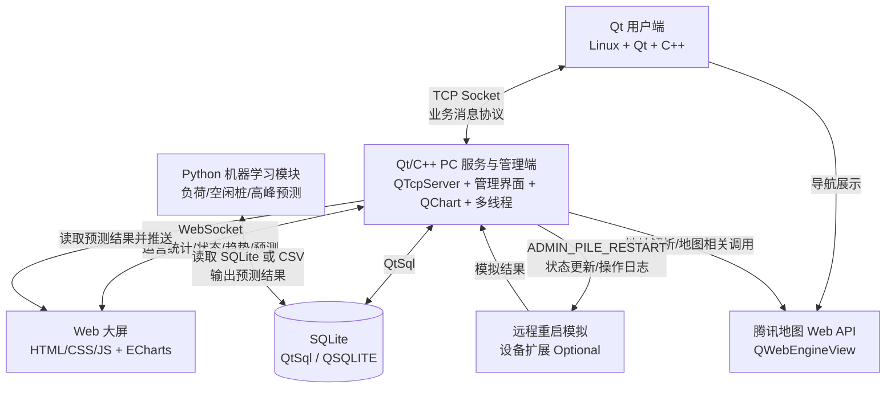

# 东软电动汽车充电桩应用管理平台

本项目是计科小学期一周开发项目，当前阶段为需求与规范修订阶段。

根据当前评审结论，项目主技术路线调整为：

- 用户端：Linux + Qt + C++；
- PC 服务与管理端：Linux + Qt + C++；
- 数据库：QtSql + SQLite，Qt 驱动名为 `QSQLITE`；
- 通信：Socket；
- Web 大屏通信：WebSocket；
- 主程序：多线程；
- 管理端图表：QChart；
- 导航：腾讯地图 Web API + QWebEngineView；
- 大屏：Web + ECharts；
- 机器学习：负荷、空闲桩和高峰时段预测。

Spring Boot、MySQL 和 REST 不再作为项目主架构组成部分。

## 1. 项目目标

系统最终应形成真实业务数据闭环：

```text
Qt 用户端产生充电行为
        ↓
Socket 消息进入 Qt/C++ PC 服务与管理端
        ↓
Qt 服务端执行业务规则并写入 SQLite
        ↓
Qt 管理界面读取运营变化并展示 QChart
        ↓
Web 大屏通过 WebSocket 接收运营与预测数据
        ↓
Python ML 使用历史数据预测
        ↓
预测结果写回 SQLite 或导出给系统展示
```

## 2. 系统模块

### 2.1 Qt 用户端

面向新能源汽车车主，覆盖手机号登录与自动注册、用户资料维护、头像选择、钱包充值、地址定位、附近充电站查询、腾讯地图导航、充电桩选择、订单创建、充电模拟、停止充电、计费结算、未完成订单检查和预测推荐展示。

用户端使用 `QTcpSocket` 与 PC 服务端通信，不直接访问 SQLite。

### 2.2 Qt/C++ PC 服务与管理端

PC 服务与管理端同时承担服务端和运营管理界面职责：

- 使用 `QTcpServer` 接收 Qt 用户端连接；
- 处理登录、站点、电桩、订单、充值、结算等核心业务；
- 通过 QtSql 的 `QSQLITE` 驱动读写 SQLite；
- 使用多线程处理连接、业务、充电计时和界面刷新；
- 使用 QChart 展示营收趋势和电桩状态统计；
- 支持管理员登录、站点管理、电桩管理、用户管理、冻结/解冻、手机号模糊查询和远程重启模拟。

### 2.3 SQLite 数据库

SQLite 是主业务数据库，保存用户、管理员、充电站、充电桩、订单、充值记录、预测结果和操作日志。

### 2.4 Web 数据可视化大屏

Web 大屏使用 HTML、CSS、JavaScript 和 ECharts 展示统计与预测数据。V1 采用 WebSocket 连接 Qt/C++ PC 服务与管理端，由服务端推送或按请求返回运营统计、状态分布、趋势和预测结果。

### 2.5 Python 机器学习模块

ML 模块保留为基本功能，负责基于固定演示数据和运行时订单数据完成负荷预测、空闲桩预测和高峰时段预测。FastAPI 只能作为可选辅助工具，不能替代 Qt/C++ 主服务。

### 2.6 远程重启模拟

必做范围只要求管理员发送远程重启指令、系统返回处理结果并更新状态或日志。完整设备网关、心跳、遥测和串口协议作为扩展内容，不作为核心业务通信的替代。

## 3. 总体架构



## 4. 仓库结构

```text
evcharge-platform/

├── qt-user/
├── qt-server-admin/
├── database/
│   ├── schema.sql
│   ├── init_data.sql
│   └── README.md
├── web-dashboard/
├── ml/
├── docs/
│   ├── 00-SRS-V1.0.md
│   ├── 01-ARCHITECTURE.md
│   ├── 02-DEVELOPMENT-GUIDE.md
│   ├── 03-API.md
│   ├── 04-DATABASE.md
│   ├── 05-GIT-WORKFLOW.md
│   ├── 06-AGENT-GUIDE.md
│   └── 07-DEVICE-PROTOCOL.md
├── README.md
└── .gitignore
```

## 5. 文档

| 文档 | 作用 |
| --- | --- |
| `docs/00-SRS-V1.0.md` | 需求基线候选版 |
| `docs/01-ARCHITECTURE.md` | Qt/C++、Socket、SQLite 架构 |
| `docs/02-DEVELOPMENT-GUIDE.md` | Qt/C++ 开发、线程、错误处理和模块规范 |
| `docs/03-API.md` | Socket/WebSocket 应用层消息协议与 ML 数据交换 |
| `docs/04-DATABASE.md` | SQLite 与 QtSql 数据库规范 |
| `docs/05-GIT-WORKFLOW.md` | Git、Review、集成规范 |
| `docs/06-AGENT-GUIDE.md` | Agent 协作约束 |
| `docs/07-DEVICE-PROTOCOL.md` | 远程重启模拟与扩展设备协议 |

## 6. 当前待确认事项

- 多线程是否必须直接使用 pthread，还是 `QThread` 即可。
- ML 是否有老师提供的统一数据集或最低精度要求。
- 团队成员角色 PM / TL / PRL / SCML / PE 的最终负责人。
