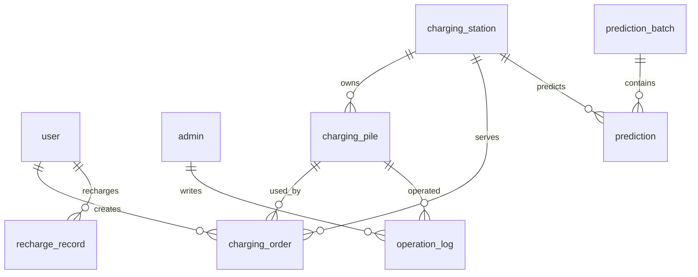

# SQLite 数据库模式设计

本文档定义 V1 数据库模式。Qt/C++ 服务端直接对接 SQLite；Qt 用户端、Qt 管理端和 WebSocket 大屏只通过服务端获取数据；Python ML 只对接服务端导出的训练数据和预测结果导入契约。

## 1. 设计边界

数据库主线：

- 数据库：SQLite；
- Qt 驱动：QtSql `QSQLITE`；
- 数据库文件：`database/evcharge.db`；
- 建表脚本：`database/schema.sql`；
- 演示数据脚本：`database/init_data.sql`。

访问边界：

- 只有 Qt/C++ 服务端可以直接读写 SQLite；
- Qt 用户端只能通过 TCP Socket 访问业务数据；
- Qt 管理端只能通过 TCP Socket 访问管理数据；
- Web 大屏只能通过 WebSocket 获取展示数据；
- Python ML 不得读取或写入 SQLite；服务端向其导出训练 CSV/JSON，并由服务端校验后将预测 JSON 导入 `prediction` 表；
- 不使用 MySQL、Spring Boot、REST 作为主数据链路。

## 2. 全局约定

### 2.1 命名

| 对象 | 规则 | 示例 |
| --- | --- | --- |
| 表名 | snake_case，单数名词 | `charging_order` |
| 字段名 | snake_case | `price_fen_per_kwh` |
| Qt/C++ 类名 | PascalCase | `ChargingOrder` |
| Socket/WebSocket 字段 | camelCase | `priceFenPerKwh` |

### 2.2 类型

| 数据 | SQLite 类型 | 说明 |
| --- | --- | --- |
| 主键 | `INTEGER PRIMARY KEY AUTOINCREMENT` | 自增整型主键 |
| 外键 | `INTEGER` | 引用其他表 `id` |
| 字符串 | `TEXT` | 普通文本、枚举、时间 |
| 金额 | `INTEGER` | 单位为分 |
| 电量 | `REAL` | 单位为 kWh |
| 功率 | `REAL` | 单位为 kW |
| 距离 | `REAL` | 单位为 km |
| 比率 | `REAL` | 0 到 1 |
| 时间 | `TEXT` | `yyyy-MM-dd HH:mm:ss` |
| 布尔 | `INTEGER` | 0 false，1 true |

### 2.3 通用字段

除关联表或日志明细特殊说明外，业务表推荐包含：

| 字段 | 类型 | 说明 |
| --- | --- | --- |
| `id` | `INTEGER PRIMARY KEY AUTOINCREMENT` | 主键 |
| `created_at` | `TEXT NOT NULL` | 创建时间 |
| `updated_at` | `TEXT NOT NULL` | 更新时间 |

时间统一使用本地时间，格式为 `yyyy-MM-dd HH:mm:ss`。演示阶段不处理复杂时区。

### 2.4 金额

所有金额以“分”为单位保存和计算。

| 业务含义 | 字段示例 | 类型 |
| --- | --- | --- |
| 用户余额 | `balance_fen` | `INTEGER` |
| 单价 | `price_fen_per_kwh` | `INTEGER` |
| 服务费 | `service_fee_fen_per_kwh` | `INTEGER` |
| 订单金额 | `amount_fen` | `INTEGER` |
| 充值金额 | `amount_fen` | `INTEGER` |

展示为元时由界面层转换，数据库和业务计算层不保存小数金额。

订单停止计量后统一使用：

```text
amountFen = round(energyKwh * (priceFenPerKwh + serviceFeeFenPerKwh))
```

## 3. 状态枚举

### 3.1 用户状态

| 值 | 含义 | 说明 |
| --- | --- | --- |
| `NORMAL` | 正常 | 可登录并创建新业务 |
| `FROZEN` | 冻结 | 禁止充值、预约和开始新充电；已有活动订单允许停止与结算 |

### 3.2 站点状态

| 值 | 含义 | 说明 |
| --- | --- | --- |
| `NORMAL` | 正常运营 | 可展示、可创建电桩、可被用户查询 |
| `DISABLED` | 停用 | 不推荐给用户创建新订单，历史订单保留 |

### 3.3 电桩状态

| 值 | 含义 | 是否可选 | 统计归类 |
| --- | --- | --- | --- |
| `AVAILABLE` | 空闲 | 是 | 闲置 |
| `RESERVED` | 已预约/已锁定 | 否 | 占用但未充电 |
| `CHARGING` | 充电中 | 否 | 在用 |
| `FAULT` | 故障 | 否 | 故障 |
| `OFFLINE` | 离线 | 否 | 离线 |
| `RESTARTING` | 重启中 | 否 | 重启中 |

正常流转：

```text
AVAILABLE -> RESERVED -> CHARGING -> AVAILABLE
AVAILABLE -> RESERVED -> AVAILABLE
```

第二条表示取消未开始订单。

### 3.4 订单状态

| 值 | 含义 | 是否活动订单 | 是否占用电桩 |
| --- | --- | --- | --- |
| `CREATED` | 已创建，未开始 | 是 | 是，对应电桩 `RESERVED` |
| `CHARGING` | 充电中 | 是 | 是，对应电桩 `CHARGING` |
| `PENDING_PAYMENT` | 已停止，待结算 | 是 | 否 |
| `COMPLETED` | 已结算完成 | 否 | 否 |
| `CANCELLED` | 已取消 | 否 | 否 |

订单主流程：

```text
CREATED -> CHARGING -> PENDING_PAYMENT -> COMPLETED
CREATED -> CANCELLED
PENDING_PAYMENT -> PENDING_PAYMENT
```

余额不足时订单保持 `PENDING_PAYMENT`，重复结算不能重复扣款。

## 4. 实体关系



核心关系：

- 一个用户可以有多条订单和充值记录；
- 一个站点包含多个充电桩；
- 一个电桩可以产生多条历史订单，但同一时刻最多被一个活动订单占用；
- 预测结果按站点和预测时间保存；
- 管理员操作、远程重启、冻结解冻等写入 `operation_log`。

外键和删除策略：

- V1 推荐启用 `PRAGMA foreign_keys = ON`；
- 用户、站点、电桩、订单不做物理删除；
- 用户冻结使用 `user.status = FROZEN`；
- 站点停用使用 `charging_station.status = DISABLED`；
- 电桩故障、离线、重启通过 `charging_pile.status` 表达；
- 历史订单、充值流水、预测结果和操作日志必须保留，便于统计和答辩演示。

## 5. 表结构

### 5.1 `user`

用途：保存车主账号、资料、钱包余额和状态。

| 字段 | 类型 | Null | 默认 | 说明 | 对外字段 |
| --- | --- | --- | --- | --- | --- |
| `id` | `INTEGER PRIMARY KEY AUTOINCREMENT` | N |  | 用户 ID | `userId` |
| `phone` | `TEXT` | N |  | 11 位手机号，唯一 | `phone` |
| `nickname` | `TEXT` | N |  | 昵称，2 到 20 字符 | `nickname` |
| `avatar_path` | `TEXT` | Y |  | 头像相对路径 | `avatarPath` |
| `balance_fen` | `INTEGER` | N | 0 | 钱包余额，单位分 | `balanceFen` |
| `status` | `TEXT` | N | `NORMAL` | `NORMAL` / `FROZEN` | `status` |
| `last_login_at` | `TEXT` | Y |  | 最近登录时间 | `lastLoginAt` |
| `created_at` | `TEXT` | N |  | 注册时间 | `createdAt` |
| `updated_at` | `TEXT` | N |  | 更新时间 | `updatedAt` |

约束：

- `phone` 唯一；
- `balance_fen >= 0`；
- `status in ('NORMAL', 'FROZEN')`；
- 冻结用户仍保留历史订单和充值记录。

### 5.2 `admin`

用途：保存管理员账号。

| 字段 | 类型 | Null | 默认 | 说明 | 对外字段 |
| --- | --- | --- | --- | --- | --- |
| `id` | `INTEGER PRIMARY KEY AUTOINCREMENT` | N |  | 管理员 ID | `adminId` |
| `username` | `TEXT` | N |  | 登录名，唯一 | `username` |
| `password_hash` | `TEXT` | N |  | 密码哈希，不保存明文 | 不返回 |
| `display_name` | `TEXT` | N |  | 展示名称 | `displayName` |
| `status` | `TEXT` | N | `NORMAL` | `NORMAL` / `FROZEN` | `status` |
| `last_login_at` | `TEXT` | Y |  | 最近登录时间 | `lastLoginAt` |
| `created_at` | `TEXT` | N |  | 创建时间 | `createdAt` |
| `updated_at` | `TEXT` | N |  | 更新时间 | `updatedAt` |

约束：

- `username` 唯一；
- 初始演示账号为 `admin / 123456`，脚本中必须写入哈希后的密码；
- 密码保存格式固定为 `pbkdf2_sha256$iterations$salt_hex$hash_hex`，使用 PBKDF2-HMAC-SHA256；每个账号必须生成独立的随机盐。V1 种子数据的迭代次数为 `210000`；
- Socket 返回中不得包含 `password_hash`。

### 5.3 `charging_station`

用途：保存充电站基础信息、地理位置和默认价格。

| 字段 | 类型 | Null | 默认 | 说明 | 对外字段 |
| --- | --- | --- | --- | --- | --- |
| `id` | `INTEGER PRIMARY KEY AUTOINCREMENT` | N |  | 站点 ID | `stationId` |
| `station_no` | `TEXT` | N |  | 站点编号，唯一 | `stationNo` |
| `name` | `TEXT` | N |  | 站点名称 | `name` |
| `address` | `TEXT` | N |  | 详细地址 | `address` |
| `district` | `TEXT` | Y |  | 区域/行政区 | `district` |
| `longitude` | `REAL` | N |  | 经度 | `longitude` |
| `latitude` | `REAL` | N |  | 纬度 | `latitude` |
| `price_fen_per_kwh` | `INTEGER` | N |  | 默认电价，分/kWh | `priceFenPerKwh` |
| `service_fee_fen_per_kwh` | `INTEGER` | N | 0 | 默认服务费，分/kWh | `serviceFeeFenPerKwh` |
| `status` | `TEXT` | N | `NORMAL` | `NORMAL` / `DISABLED` | `status` |
| `created_at` | `TEXT` | N |  | 创建时间 | `createdAt` |
| `updated_at` | `TEXT` | N |  | 更新时间 | `updatedAt` |

约束：

- `station_no` 唯一；
- `price_fen_per_kwh >= 0`；
- `service_fee_fen_per_kwh >= 0`；
- `status in ('NORMAL', 'DISABLED')`；
- 经纬度由地图 API 或演示数据提供；
- 新增站点时，由服务层按输入数量自动创建电桩。

### 5.4 `charging_pile`

用途：保存充电桩基础信息、实时状态和累计统计。

| 字段 | 类型 | Null | 默认 | 说明 | 对外字段 |
| --- | --- | --- | --- | --- | --- |
| `id` | `INTEGER PRIMARY KEY AUTOINCREMENT` | N |  | 电桩 ID | `pileId` |
| `station_id` | `INTEGER` | N |  | 所属站点 ID | `stationId` |
| `pile_no` | `TEXT` | N |  | 电桩编号 | `pileNo` |
| `type` | `TEXT` | N |  | `FAST` / `SLOW` | `type` |
| `power_kw` | `REAL` | N |  | 额定功率，kW | `powerKw` |
| `status` | `TEXT` | N | `AVAILABLE` | 电桩状态 | `status` |
| `current_order_id` | `INTEGER` | Y |  | 当前占用订单 ID | `currentOrderId` |
| `total_charge_count` | `INTEGER` | N | 0 | 累计完成充电次数 | `totalChargeCount` |
| `total_charge_minutes` | `INTEGER` | N | 0 | 累计充电分钟数 | `totalChargeMinutes` |
| `total_energy_kwh` | `REAL` | N | 0 | 累计充电量 | `totalEnergyKwh` |
| `last_heartbeat_at` | `TEXT` | Y |  | 扩展设备心跳时间 | `lastHeartbeatAt` |
| `created_at` | `TEXT` | N |  | 创建时间 | `createdAt` |
| `updated_at` | `TEXT` | N |  | 更新时间 | `updatedAt` |

约束：

- `(station_id, pile_no)` 唯一；
- `station_id` 引用 `charging_station.id`；
- `type in ('FAST', 'SLOW')`；
- `power_kw > 0`；
- `total_charge_count >= 0`、`total_charge_minutes >= 0`、`total_energy_kwh >= 0`；
- `status in ('AVAILABLE', 'RESERVED', 'CHARGING', 'FAULT', 'OFFLINE', 'RESTARTING')`；
- `current_order_id` 只在 `RESERVED` 或 `CHARGING` 时填写，释放后置空；
- 只有 `AVAILABLE` 电桩可被用户创建订单。

### 5.5 `charging_order`

用途：保存预约、充电、停止、结算和取消全过程。

| 字段 | 类型 | Null | 默认 | 说明 | 对外字段 |
| --- | --- | --- | --- | --- | --- |
| `id` | `INTEGER PRIMARY KEY AUTOINCREMENT` | N |  | 订单 ID | `orderId` |
| `order_no` | `TEXT` | N |  | 订单编号，唯一 | `orderNo` |
| `user_id` | `INTEGER` | N |  | 用户 ID | `userId` |
| `station_id` | `INTEGER` | N |  | 站点 ID，订单创建时冗余 | `stationId` |
| `pile_id` | `INTEGER` | N |  | 电桩 ID | `pileId` |
| `status` | `TEXT` | N | `CREATED` | 订单状态 | `status` |
| `price_fen_per_kwh` | `INTEGER` | N |  | 下单时电价快照 | `priceFenPerKwh` |
| `service_fee_fen_per_kwh` | `INTEGER` | N | 0 | 下单时服务费快照 | `serviceFeeFenPerKwh` |
| `start_at` | `TEXT` | Y |  | 开始充电时间 | `startAt` |
| `end_at` | `TEXT` | Y |  | 停止充电时间 | `endAt` |
| `charge_minutes` | `INTEGER` | N | 0 | 充电分钟数 | `chargeMinutes` |
| `energy_kwh` | `REAL` | N | 0 | 充电量 | `energyKwh` |
| `amount_fen` | `INTEGER` | N | 0 | 应付金额，分 | `amountFen` |
| `paid_at` | `TEXT` | Y |  | 结算时间 | `paidAt` |
| `cancelled_at` | `TEXT` | Y |  | 取消时间 | `cancelledAt` |
| `cancel_reason` | `TEXT` | Y |  | 取消原因 | `cancelReason` |
| `created_at` | `TEXT` | N |  | 创建时间 | `createdAt` |
| `updated_at` | `TEXT` | N |  | 更新时间 | `updatedAt` |

约束：

- `order_no` 唯一；
- `user_id` 引用 `user.id`；
- `station_id` 引用 `charging_station.id`；
- `pile_id` 引用 `charging_pile.id`；
- `status in ('CREATED', 'CHARGING', 'PENDING_PAYMENT', 'COMPLETED', 'CANCELLED')`；
- `price_fen_per_kwh >= 0`、`service_fee_fen_per_kwh >= 0`；
- `energy_kwh >= 0`，`amount_fen >= 0`，`charge_minutes >= 0`；
- `CREATED` 订单对应电桩 `RESERVED`；
- `CHARGING` 订单对应电桩 `CHARGING`；
- `PENDING_PAYMENT`、`COMPLETED`、`CANCELLED` 不占用电桩。

服务层强约束：

- 同一用户只能存在一个活动订单，活动状态为 `CREATED`、`CHARGING`、`PENDING_PAYMENT`；
- 同一电桩只能存在一个占用订单，占用状态为 `CREATED`、`CHARGING`；
- `ORDER_CANCEL` 只允许取消 `CREATED`；
- `ORDER_SETTLE` 必须和用户余额扣减在同一事务中完成。

### 5.6 `recharge_record`

用途：保存钱包充值流水。

| 字段 | 类型 | Null | 默认 | 说明 | 对外字段 |
| --- | --- | --- | --- | --- | --- |
| `id` | `INTEGER PRIMARY KEY AUTOINCREMENT` | N |  | 充值记录 ID | `rechargeId` |
| `record_no` | `TEXT` | N |  | 流水号，唯一 | `recordNo` |
| `user_id` | `INTEGER` | N |  | 用户 ID | `userId` |
| `amount_fen` | `INTEGER` | N |  | 充值金额，分 | `amountFen` |
| `balance_after_fen` | `INTEGER` | N |  | 充值后余额快照 | `balanceAfterFen` |
| `status` | `TEXT` | N | `SUCCESS` | `SUCCESS` / `FAILED` | `status` |
| `remark` | `TEXT` | Y |  | 备注 | `remark` |
| `created_at` | `TEXT` | N |  | 创建时间 | `createdAt` |

约束：

- `record_no` 唯一；
- `amount_fen > 0`；
- `balance_after_fen >= 0`；
- 充值成功时，`user.balance_fen` 与 `recharge_record` 写入必须在同一事务中完成。

### 5.7 `prediction`

用途：保存 ML 预测结果，供用户端推荐、管理端预警和 WebSocket 大屏展示。

| 字段 | 类型 | Null | 默认 | 说明 | 对外字段 |
| --- | --- | --- | --- | --- | --- |
| `id` | `INTEGER PRIMARY KEY AUTOINCREMENT` | N |  | 预测 ID | `predictionId` |
| `batch_id` | `TEXT` | N |  | 导入批次 ID，引用 `prediction_batch` | `batchId` |
| `station_id` | `INTEGER` | N |  | 站点 ID | `stationId` |
| `prediction_time` | `TEXT` | N |  | 被预测的目标时间 | `predictionTime` |
| `horizon` | `TEXT` | N |  | `1h` / `6h` / `24h` | `horizon` |
| `predicted_load` | `REAL` | N |  | 站点负荷，0 到 1 | `predictedLoad` |
| `predicted_available_count` | `INTEGER` | Y |  | 预测空闲桩数 | `predictedAvailableCount` |
| `peak_level` | `TEXT` | Y |  | `LOW` / `MEDIUM` / `HIGH` | `peakLevel` |
| `model_name` | `TEXT` | Y |  | 模型名称 | `modelName` |
| `mae` | `REAL` | Y |  | 可选评价指标 | `mae` |
| `rmse` | `REAL` | Y |  | 可选评价指标 | `rmse` |
| `generated_at` | `TEXT` | N |  | 预测生成时间 | `generatedAt` |
| `created_at` | `TEXT` | N |  | 入库时间 | `createdAt` |

负荷口径：

```text
stationLoad = chargingPileMinutes / (totalPileCount * windowMinutes)
```

说明：

- `predicted_load` 保存 0 到 1 的 `REAL`；
- `predicted_available_count`、`peak_level` 和 `model_name` 是 ML 导入契约必填字段；预测空闲桩数必须 `>= 0`。可选的 `mae`、`rmse` 有值时也必须 `>= 0`；
- 展示层可转换为百分比；
- `chargingPileMinutes` 只统计 `CHARGING` 占用时长，不统计 `RESERVED`、`FAULT`、`OFFLINE`、`RESTARTING`；
- 每条预测必须属于一个 `prediction_batch`；`(batch_id, station_id, prediction_time, horizon)` 唯一。重复导入同一 batch 必须幂等，内容不一致时拒绝；不同 batch 的历史记录可以并存。

### 5.7.1 `prediction_batch`

| 字段 | 类型 | 说明 |
| --- | --- | --- |
| `batch_id` | `TEXT PRIMARY KEY` | ML 输出的批次 ID |
| `status` | `TEXT` | 当前 V1 为 `IMPORTED` |
| `generated_at` | `TEXT` | 批次生成时间，必填 |
| `created_at` | `TEXT` | 批次入库时间，必填 |

### 5.8 `operation_log`

用途：保存管理员操作、远程重启、冻结解冻和关键异常。

| 字段 | 类型 | Null | 默认 | 说明 | 对外字段 |
| --- | --- | --- | --- | --- | --- |
| `id` | `INTEGER PRIMARY KEY AUTOINCREMENT` | N |  | 日志 ID | `logId` |
| `admin_id` | `INTEGER` | Y |  | 管理员 ID，系统动作可为空 | `adminId` |
| `action` | `TEXT` | N |  | 操作类型 | `action` |
| `target_type` | `TEXT` | N |  | `USER` / `STATION` / `PILE` / `ORDER` / `SYSTEM` | `targetType` |
| `target_id` | `INTEGER` | Y |  | 目标 ID | `targetId` |
| `before_status` | `TEXT` | Y |  | 操作前状态 | `beforeStatus` |
| `after_status` | `TEXT` | Y |  | 操作后状态 | `afterStatus` |
| `result` | `TEXT` | N | `SUCCESS` | `SUCCESS` / `FAILED` | `result` |
| `message` | `TEXT` | Y |  | 结果说明 | `message` |
| `created_at` | `TEXT` | N |  | 操作时间 | `createdAt` |

推荐 `action`：

| action | 场景 |
| --- | --- |
| `ADMIN_LOGIN` | 管理员登录 |
| `USER_FREEZE` | 冻结用户 |
| `USER_UNFREEZE` | 解冻用户 |
| `STATION_CREATE` | 新增站点 |
| `PILE_RESTART` | 远程重启模拟 |
| `PILE_STATUS_CHANGE` | 电桩状态变更 |
| `ORDER_STATE_CHANGE` | 订单状态变更 |
| `SYSTEM_ERROR` | 关键系统异常 |

远程重启必须记录管理员、电桩、操作前状态、操作后状态和结果消息。

### 5.9 `data_import_batch`

用途：记录公开数据或模拟数据的来源、授权、文件哈希、时间平移量和质量计数。核心字段为 `batch_no`、`source_name`、`source_url`、`license_name`、`source_sha256`、`source_row_count`、`accepted_row_count` 和 `imported_at`。`batch_no` 全局唯一，接收数量不得超过来源数量。

### 5.10 `charging_session_history`

用途：保存外部数据真实提供的会话事实，不伪造成 `charging_order`、用户消费或钱包交易。字段包括来源批次、来源会话键、项目站点 ID、UTC 开始/结束时间、持续秒数和电量。`batch_id + source_session_key` 唯一。

该表只用于模型历史和数据溯源，不参与用户订单状态机、计费、支付和营收统计。

### 5.11 `station_hourly_metric`

用途：保存服务端可直接导出给 ML 的连续小时指标。主要字段如下：

| 字段 | 说明 |
| --- | --- |
| `station_id`, `hour_start` | 项目站点和 UTC 小时起点 |
| `total_pile_count` | 该来源在该小时使用的容量基数 |
| `session_starts`, `energy_kwh` | 小时会话数和充电量 |
| `charging_pile_minutes` | 所有充电占用分钟之和 |
| `average_occupied_count`, `peak_occupied_count` | 平均及峰值占用数 |
| `average_available_count`, `station_load` | 平均空闲数和 0 到 1 负荷率 |
| `reserved_pile_minutes`, `fault_pile_minutes`, `offline_pile_minutes` | 业务运行数据可补充的不可用原因 |
| `source_type`, `source_batch_id` | `BUSINESS` 或 `CARY_SIMULATION` 及来源批次 |

`lag_24`、`lag_168`、滚动均值、日历周期和 one-hot 等模型特征必须由 Python 动态构造，不写入数据库。

## 6. 推荐索引

```sql
CREATE UNIQUE INDEX idx_user_phone ON user(phone);
CREATE UNIQUE INDEX idx_admin_username ON admin(username);
CREATE UNIQUE INDEX idx_station_no ON charging_station(station_no);
CREATE UNIQUE INDEX idx_pile_station_no ON charging_pile(station_id, pile_no);
CREATE UNIQUE INDEX idx_order_no ON charging_order(order_no);
CREATE UNIQUE INDEX idx_recharge_no ON recharge_record(record_no);

CREATE INDEX idx_station_district ON charging_station(district);
CREATE INDEX idx_pile_station_status ON charging_pile(station_id, status);
CREATE INDEX idx_order_user_status ON charging_order(user_id, status);
CREATE INDEX idx_order_pile_status ON charging_order(pile_id, status);
CREATE INDEX idx_order_station_created ON charging_order(station_id, created_at);
CREATE INDEX idx_order_status_created ON charging_order(status, created_at);
CREATE INDEX idx_recharge_user_created ON recharge_record(user_id, created_at);
CREATE INDEX idx_prediction_station_time ON prediction(station_id, prediction_time);
CREATE INDEX idx_operation_target_created ON operation_log(target_type, target_id, created_at);
CREATE UNIQUE INDEX idx_import_batch_no ON data_import_batch(batch_no);
CREATE UNIQUE INDEX idx_session_batch_key ON charging_session_history(batch_id, source_session_key);
CREATE INDEX idx_session_station_start ON charging_session_history(station_id, start_at);
CREATE UNIQUE INDEX idx_metric_station_hour_source ON station_hourly_metric(station_id, hour_start, source_type);
CREATE INDEX idx_metric_source_hour ON station_hourly_metric(source_type, hour_start);
```

说明：

- 活动订单互斥建议由 Service 层事务保护；
- SQLite 可使用部分索引表达复杂约束，但为了降低一周项目风险，文档要求 Service 层必须再次校验；
- 查询站点列表、营收统计、大屏趋势和用户订单列表时，应优先命中上述索引。

## 7. 事务规则

### 7.1 手机号登录与自动注册

当手机号不存在：

1. 插入 `user`；
2. 默认 `nickname = '用户' + 手机号后四位`；
3. `balance_fen = 0`；
4. `status = NORMAL`。

手机号存在时：

1. 校验用户状态；
2. 若 `FROZEN` 且无活动订单，拒绝新业务；
3. 若有活动订单，可允许进入停止/结算收尾流程；
4. 更新 `last_login_at`。

### 7.2 创建订单

必须在同一事务中完成：

1. 查询用户是否存在活动订单；
2. 查询电桩是否为 `AVAILABLE`；
3. 插入 `charging_order`，状态为 `CREATED`；
4. 更新 `charging_pile.status = RESERVED`；
5. 写入 `charging_pile.current_order_id`。

失败时全部回滚。

### 7.3 取消未开始订单

必须在同一事务中完成：

1. 校验订单属于当前用户；
2. 校验订单状态为 `CREATED`；
3. 更新订单为 `CANCELLED`，写入 `cancelled_at` 和 `cancel_reason`；
4. 更新电桩为 `AVAILABLE`；
5. 清空 `charging_pile.current_order_id`。

### 7.4 开始充电

必须在同一事务中完成：

1. 校验订单状态为 `CREATED`；
2. 校验电桩状态为 `RESERVED` 且 `current_order_id` 匹配；
3. 更新订单为 `CHARGING`，写入 `start_at`；
4. 更新电桩为 `CHARGING`。

### 7.5 停止充电

必须在同一事务中完成：

1. 校验订单状态为 `CHARGING`；
2. 计算 `charge_minutes`、`energy_kwh`、`amount_fen`；
3. 更新订单为 `PENDING_PAYMENT`，写入 `end_at`；
4. 更新电桩为 `AVAILABLE`；
5. 清空 `charging_pile.current_order_id`。

计费公式：

```text
amountFen = round(energyKwh * (priceFenPerKwh + serviceFeeFenPerKwh))
```

### 7.6 结算订单

必须在同一事务中完成：

1. 校验订单状态为 `PENDING_PAYMENT`；
2. 查询用户余额；
3. 余额不足时不扣款，订单仍为 `PENDING_PAYMENT`；
4. 余额足够时扣减 `user.balance_fen`；
5. 更新订单为 `COMPLETED`，写入 `paid_at`；
6. 更新电桩累计统计 `total_charge_count`、`total_charge_minutes`、`total_energy_kwh`。

重复结算时：

- `COMPLETED` 订单直接返回已完成，不再次扣款；
- 非 `PENDING_PAYMENT` / `COMPLETED` 状态返回非法状态。

### 7.7 充值

必须在同一事务中完成：

1. 校验用户为 `NORMAL`；
2. 增加 `user.balance_fen`；
3. 插入 `recharge_record`；
4. 记录充值后余额快照。

### 7.8 冻结用户

冻结只改变用户状态，不修改历史订单。

规则：

- 冻结后禁止充值、创建订单、开始新充电；
- 若冻结前已有 `CHARGING` 或 `PENDING_PAYMENT` 订单，允许停止和结算；
- 冻结/解冻操作写入 `operation_log`。

### 7.9 远程重启

必须在同一事务或连续可靠步骤中完成：

1. 校验电桩存在；
2. `RESERVED` 或 `CHARGING` 电桩拒绝重启；
3. 记录操作前状态；
4. 将电桩置为 `RESTARTING`；
5. 模拟完成后恢复为 `AVAILABLE` 或原可用状态；
6. 写入 `operation_log`。

## 8. 查询与统计口径

### 8.1 空闲桩数量

```sql
SELECT COUNT(*)
FROM charging_pile
WHERE station_id = :station_id
  AND status = 'AVAILABLE';
```

只统计 `AVAILABLE`，不包含 `RESERVED`。

### 8.2 今日营收

```sql
SELECT COALESCE(SUM(amount_fen), 0)
FROM charging_order
WHERE status = 'COMPLETED'
  AND paid_at >= :today_start
  AND paid_at < :tomorrow_start;
```

只统计已结算订单，以 `paid_at` 为准。

### 8.3 本月营收

```sql
SELECT COALESCE(SUM(amount_fen), 0)
FROM charging_order
WHERE status = 'COMPLETED'
  AND paid_at >= :month_start
  AND paid_at < :next_month_start;
```

### 8.4 近 7 日 / 30 日趋势

日期范围包含当天。按 `paid_at` 的本地日期聚合。

输出字段建议：

| 字段 | 说明 |
| --- | --- |
| `date` | 日期，`yyyy-MM-dd` |
| `revenueFen` | 当日营收 |
| `energyKwh` | 当日充电量 |
| `orderCount` | 当日完成订单数 |

### 8.5 电桩状态分布

按 `charging_pile.status` 聚合。大屏和管理端展示需保持同一口径：

| 分类 | 状态 |
| --- | --- |
| 闲置 | `AVAILABLE` |
| 已预约 | `RESERVED` |
| 在用 | `CHARGING` |
| 故障 | `FAULT` |
| 离线 | `OFFLINE` |
| 重启中 | `RESTARTING` |

### 8.6 站点负荷

站点负荷用于 ML、用户推荐、管理端预警和 Web 大屏：

```text
stationLoad = chargingPileMinutes / (totalPileCount * windowMinutes)
```

示例：

```text
一个站点有 10 个电桩，统计窗口 60 分钟。
所有电桩合计充电占用 360 分钟。
stationLoad = 360 / (10 * 60) = 0.6
```

只统计订单 `CHARGING` 对应的实际充电时间，不统计 `RESERVED`。

## 9. 模块对接说明

### 9.1 Qt 用户端

用户端不读数据库。需要的数据由 Socket 消息返回：

| 功能 | 主要表 | 关键字段 |
| --- | --- | --- |
| 登录/资料 | `user` | `phone`, `nickname`, `avatar_path`, `balance_fen`, `status` |
| 站点列表 | `charging_station`, `charging_pile` | `name`, `address`, `longitude`, `latitude`, `price_fen_per_kwh`, `status` |
| 电桩列表 | `charging_pile` | `pile_no`, `type`, `power_kw`, `status` |
| 订单流程 | `charging_order`, `charging_pile`, `user` | `status`, `energy_kwh`, `amount_fen`, `balance_fen` |
| 推荐站点 | `prediction`, `charging_station` | `predicted_load`, `predicted_available_count` |

### 9.2 Qt 管理端

管理端不读数据库。需要的数据由 `ADMIN_*` Socket 消息返回：

| 功能 | 主要表 | 关键字段 |
| --- | --- | --- |
| 营收统计 | `charging_order` | `amount_fen`, `energy_kwh`, `paid_at`, `status` |
| 电桩管理 | `charging_station`, `charging_pile` | `pile_no`, `type`, `power_kw`, `status` |
| 用户管理 | `user` | `phone`, `nickname`, `balance_fen`, `status` |
| 远程重启 | `charging_pile`, `operation_log` | `status`, `action`, `before_status`, `after_status` |
| 负荷预警 | `prediction`, `charging_station` | `predicted_load`, `predicted_available_count`, `peak_level` |

### 9.3 Qt/C++ 服务端

Qt/C++ 服务端是唯一主数据写入方，负责：

- 业务事务；
- 状态流转；
- 统计聚合；
- WebSocket 大屏数据服务；
- ML 结果导入；
- 操作日志写入。

### 9.4 WebSocket 大屏

大屏不读 SQLite。Qt/C++ 服务端从数据库聚合后通过 WebSocket 推送：

| topic | 来源表 | 字段 |
| --- | --- | --- |
| `summary` | `charging_order`, `charging_pile`, `prediction` | 今日电量、今日营收、总订单、站点负荷 |
| `pileStatus` | `charging_pile` | 各状态数量与占比 |
| `revenueTrend` | `charging_order` | 近 7 日/30 日营收与电量 |
| `prediction` | `prediction`, `charging_station` | 负荷、空闲桩、高峰等级 |

### 9.5 Python ML 数据导出与结果导入

Python ML 不直接查询下列来源表。Qt/C++ 服务端按以下字段导出训练数据；具体文件路径、输出 JSON 和校验规则以 `docs/03-API.md` 第 14 节为准。

| 来源 | 字段 |
| --- | --- |
| `station_hourly_metric` | `hour_start`, `station_id`, `total_pile_count`, `session_starts`, `energy_kwh`, `station_load` |

服务端导出时将 `hour_start` 命名为 `timestamp`，并按 `station_id, hour_start` 排序。每个站点必须每小时一行；没有会话的小时也要补零。`database/simulation/export_ml_history.py` 是开发期参考实现，生产运行仍由 Qt/C++ 服务端完成相同导出。

ML 输出的每条预测记录必须提供以下字段，由 Qt/C++ 服务端写入 `prediction`：

- `station_id`；
- `prediction_time`；
- `horizon`；
- `predicted_load`。
- `generated_at`（JSON 中为必填 `generatedAt`）。

`batchId` 必须先写入 `prediction_batch`，然后在同一事务中写入预测记录。服务端必须校验站点存在性、真实 `charging_pile` 数量、`horizon`、负荷范围和字段完整性；`predicted_available_count` 不得超过当前站点实际桩数。任一记录不合法时整批回滚；已导入的相同 `batchId` 重复请求必须幂等。

## 10. QtSql 使用要求

示例查询：

```cpp
QSqlQuery query(db);
query.prepare("SELECT id, phone, nickname FROM user WHERE phone = :phone");
query.bindValue(":phone", phone);
query.exec();
```

要求：

- 必须使用参数绑定，禁止拼接用户输入 SQL；
- 每个线程使用独立连接名；
- 不跨线程共享同一个 `QSqlDatabase`；
- 写操作集中到 Database Worker 或通过队列串行执行；
- 数据库错误必须记录 `lastError()` 并转换为统一错误码。

## 11. 初始化数据要求

`database/init_data.sql` 至少准备：

- 1 个默认管理员；
- 3 到 5 个示例用户；
- 3 到 5 个示例充电站；
- 每个站点 4 到 8 个示例电桩，状态覆盖 `AVAILABLE`、`RESERVED`、`CHARGING`、`FAULT`、`OFFLINE`；
- 若干历史完成订单，覆盖近 30 日；
- 至少 1 个待结算订单；
- 至少 1 个可取消的 `CREATED` 订单；
- 若干充值记录；
- 每个站点 1h / 6h / 24h 的预测结果；
- 若干操作日志，包含远程重启、冻结和解冻。

默认管理员：

```text
username = admin
password = 123456
```

数据库中只能保存 PBKDF2-HMAC-SHA256 派生的 `password_hash`，格式为
`pbkdf2_sha256$iterations$salt_hex$hash_hex`。登录 Service 负责解析、重新派生并比较，网络层和初始化脚本不承担登录业务。

## 12. 变更流程

数据库模式属于公共契约。变更必须同步：

- `docs/04-DATABASE.md`；
- `docs/03-API.md`；
- `docs/00-SRS-V1.0.md`；
- `database/schema.sql`；
- `database/init_data.sql`；
- 对应 Repository / Model / Service；
- WebSocket 大屏字段说明；
- ML 输入输出字段说明。

变更前必须在组内 Review 中说明：

- 修改了哪些表；
- 是否影响已有数据；
- 是否影响 Socket/WebSocket 字段；
- 是否影响 ML 输入输出；
- 是否需要迁移脚本。
