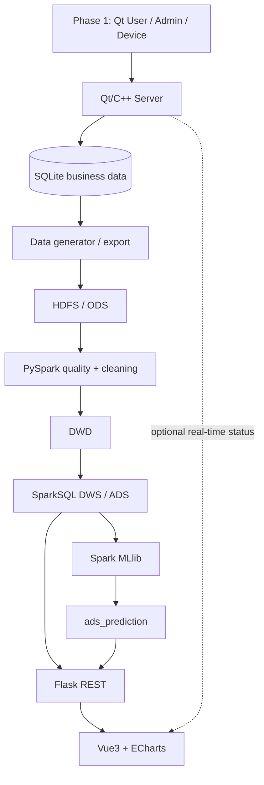

# 21. 第二阶段架构与模块边界

## 1. 架构

Phase 1 与 Phase 2 的交界是“业务语义与导出数据”，不是代码互相调用。Flask 是历史分析的
服务层；可选 Qt WebSocket 只补充实时状态，不能替代 ADS。

## 2. 接口墙与禁止依赖

| 墙 | 上游 → 下游 | 唯一接口 | 禁止 |
| --- | --- | --- | --- |
| C1 | B → C | Raw/ODS Contract | C 修改生成器内部逻辑 |
| C2 | C → D | DWD Contract | D 绕过 DWD 读取 Raw |
| C3 | D → A/E | DWS/ADS Contract | A/E 引用 warehouse 内部代码 |
| C4 | D/E → A | API/ML Contract | Vue 读 Spark/SQLite/模型文件 |

下游模块只依赖上游公开数据契约，不允许引用上游模块内部实现。每个变更均需 CCR。

## 3. Ownership

| 角色 | 主要目录 | 不得直接改动 |
| --- | --- | --- |
| A 架构/集成/大屏 | `contracts/`, `integration/`, `scripts/`, `web-dashboard/`, `docs/bigdata/` | B/C/D/E 内部实现 |
| B 数据/环境 | `environment/`, `data-generator/`, `ingestion/` | DWD、数仓、API、ML |
| C 质量/DWD | `spark/quality/`, `spark/dwd/` | Raw generator、ADS、API |
| D 数仓/API | `spark/warehouse/`, `api/` | DWD 清洗规则、Raw |
| E ML | `ml/`（Phase 2） | Raw、SQLite、Vue/API 内部实现 |

跨目录修复须先通知 Owner，并在 PR 中解释影响与测试。详细 Git 规则见 26 号文档。
