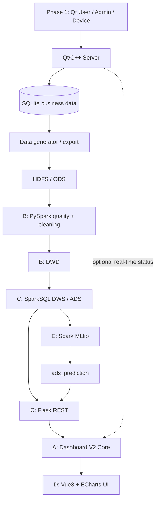

# 21. 第二阶段架构与模块边界

## 1. 架构

Phase 1 与 Phase 2 的交界是“业务语义与导出数据”，不是代码互相调用。Flask 是历史分析的
服务层；可选 Qt WebSocket 只补充实时状态，不能替代 ADS。Dashboard Core 统一 API、Mock 和
实时数据为公开 ViewModel；UI 层不认识数据的来源。

## 2. 接口墙与禁止依赖

| 墙 | 上游 → 下游 | 唯一接口 | 禁止 |
| --- | --- | --- | --- |
| C1 | B → C | DWD Contract | C 重写 Raw/清洗规则或绕过 DWD |
| C2 | C → E | DWS / ML Feature Contract | E 绕过 DWS 读取 Raw |
| C3 | C → A | Flask HTTP Contract | A 引用 Warehouse/API 内部实现 |
| C4 | A → D | Dashboard Public UI Contract | D 直连 Flask/SQLite/Spark 或另建 KPI 模型 |

下游模块只依赖上游公开数据契约，不允许引用上游模块内部实现。每个变更均需 CCR。

## 3. Ownership

| 角色 | 主要目录 | 不得直接改动 |
| --- | --- | --- |
| A Architecture / Dashboard Core / Integration | `contracts/`, `integration/`, `scripts/`, `docs/bigdata/`, `web-dashboard/src/core/` | B/C/E 内部实现；D 的 views/components/charts/styles |
| B Data Pipeline / Hadoop / Data Quality | `environment/`, `data-generator/`, `ingestion/`, `spark/quality/`, `spark/dwd/` | DWS、ADS、Flask、UI、ML |
| C Warehouse / Analytics / Flask API | `spark/warehouse/`, `api/` | Raw 清洗、Vue UI、ECharts、ML 训练 |
| D Dashboard UI / Visualization | `web-dashboard/src/views/`, `components/`, `charts/`, `styles/` | Core、Flask、SQLite、HDFS/Spark、正式 KPI 口径 |
| E Spark MLlib | `ml/`（Phase 2） | Raw、SQLite、Vue/API/Core 内部实现 |

`web-dashboard` 的 Core 与 UI 是严格分层：A 不实现布局、CSS、图表视觉 option 或页面美化；D
不修改 Core Contract。共享公共层的修改须 A、D 双方确认，并由 A 作最终 Contract Review。跨目录
修复须先通知 Owner，并在 PR 中解释影响与测试。详细 Git 规则见 26 号文档。
